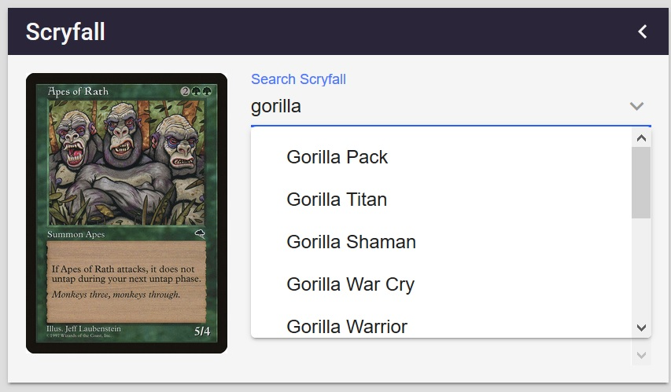
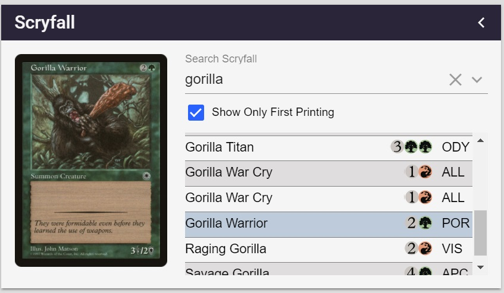
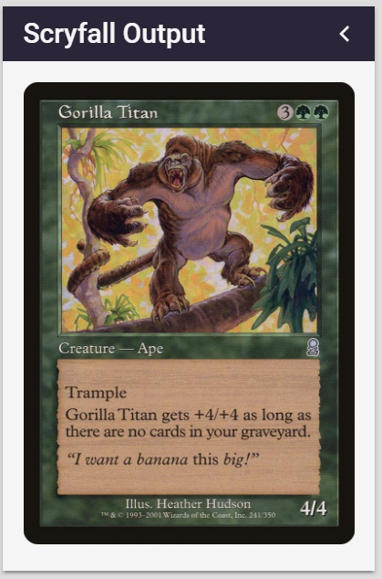

# nodecg-scryfall

[](https://greenkeeper.io/)
[](https://travis-ci.org/StreamsGood/nodecg-scryfall)

```sh
# All dependencies are managed by bower.
bower install
```

Two nodecg dashboard panels to search [scryfall](https://scryfall.com)'s Magic The Gathering card database.

### Search for Results with Scryfall's Autocomplete


### Hover over Results to preview them


### Click on a Result to change the output



Access the image in your graphics by hooking into the Replicant.

```js
replicant-name="selected"
replicant-bundle="nodecg-scryfall"

// Example: Javascript
const selected = nodecg.Replicant('selected', 'nodecg-scryfall');

// Example: nodecg-replicant WebComponent
<nodecg-replicant replicant-name="selected" replicant-bundle="nodecg-scryfall" value="{{selected}}"></nodecg-replicant>
```
